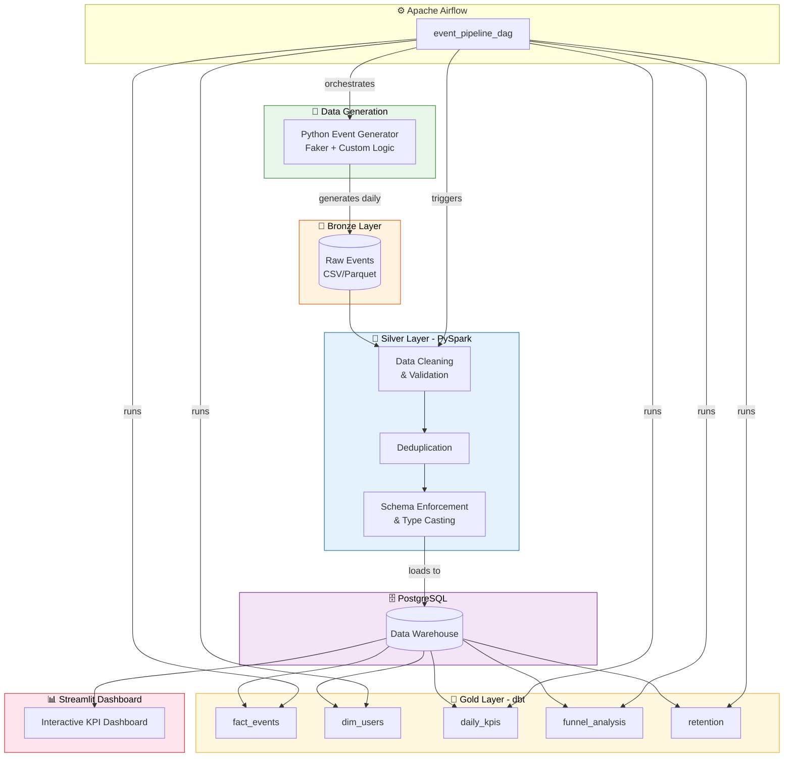
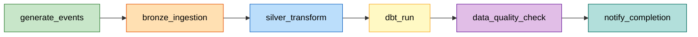
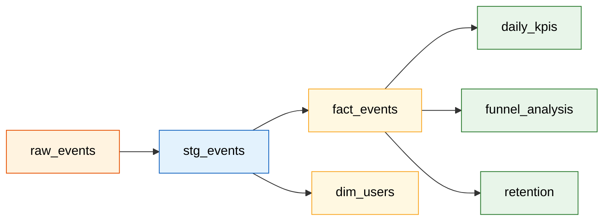

<p align="center">
  
</p>

<h1 align="center">🚀 Event Analytics Pipeline</h1>

<p align="center">
  <strong>A modern, end-to-end event analytics data pipeline for e-commerce & cashback platforms</strong>
</p>

<p align="center">
  <a href="#architecture"></a>
  <a href="#tech-stack"></a>
  <a href="#tech-stack"></a>
  <a href="#tech-stack"></a>
  <a href="#tech-stack"></a>
  <a href="#tech-stack"></a>
  <a href="#tech-stack"></a>
  <a href="#tech-stack"></a>
</p>

<p align="center">
  
  
  
</p>

---

## 📋 Table of Contents

- [Overview](#overview)
- [Architecture](#architecture)
- [Tech Stack](#tech-stack)
- [Project Structure](#project-structure)
- [Quick Start](#quick-start)
- [Pipeline Deep Dive](#pipeline-deep-dive)
- [dbt Models](#dbt-models)
- [Dashboard](#dashboard)
- [Data Quality](#data-quality)
- [Screenshots](#screenshots)
- [What I Learned](#what-i-learned)
- [Why This Project Demonstrates DE Skills](#why-this-project-demonstrates-data-engineering-skills)
- [Real-World Relevance](#real-world-relevance)
- [AI-Assisted Development](#ai-assisted-development)
- [Contributing](#contributing)
- [License](#license)

---

## 🌟 Overview

**Event Analytics Pipeline** is a production-grade data engineering project that simulates real-time user events from a shopping rewards/cashback platform (inspired by [ShopBack](https://www.shopback.com/)). It demonstrates the full lifecycle of a modern data pipeline — from event generation through transformation to interactive analytics.

### Business Problem

E-commerce cashback platforms generate millions of events daily: page views, clicks, cart additions, purchases, cashback earnings, and refunds. Turning this raw event stream into actionable insights requires a robust pipeline that can:

- **Ingest** high-volume event data reliably
- **Clean & validate** data quality at every stage
- **Transform** raw events into business-ready analytics
- **Visualize** KPIs for real-time decision making

### Key KPIs Tracked

| KPI | Description |
|-----|-------------|
| 📊 **DAU / WAU** | Daily & Weekly Active Users |
| 🔄 **Conversion Rate** | View → Purchase funnel conversion |
| 💰 **Revenue** | Total and per-user revenue |
| 🎁 **Total Cashback** | Cashback distributed to users |
| 📈 **Retention Rate** | Day-1, Day-7, Day-30 retention |
| 🔍 **Funnel Analysis** | Step-by-step drop-off analysis |
| 📋 **Event Distribution** | Event counts by type and user segment |

---

## 🏗️ Architecture

This pipeline follows the **Medallion Architecture** (Bronze → Silver → Gold), a pattern widely used in modern data lakehouses:



### Data Flow

1. **Generate** → Python script creates realistic e-commerce events with proper distributions
2. **Ingest (Bronze)** → Raw CSV files land in the Bronze layer, partitioned by date
3. **Transform (Silver)** → PySpark cleans, validates, deduplicates, and enforces schema
4. **Model (Gold)** → dbt transforms Silver data into dimensional models and KPI aggregations
5. **Visualize** → Streamlit dashboard queries PostgreSQL for interactive analytics

---

## 🛠️ Tech Stack

| Component | Technology | Purpose |
|-----------|-----------|---------|
| **Orchestration** | Apache Airflow 2.8+ | DAG-based workflow scheduling |
| **Processing** | PySpark (local mode) | Distributed data transformation |
| **SQL Modeling** | dbt-core + dbt-postgres | Dimensional modeling & testing |
| **Warehouse** | PostgreSQL 16 | Analytical data storage |
| **Exploration** | Pandas + Polars | Lightweight data manipulation |
| **Dashboard** | Streamlit | Interactive KPI visualization |
| **Containerization** | Docker + Docker Compose | One-command deployment |
| **Language** | Python 3.11+ | Core development language |
| **Quality** | Great Expectations patterns | Data validation framework |
| **Code Quality** | pre-commit, black, ruff | Linting & formatting |

---

## 📁 Project Structure

```
event-analytics-pipeline/
├── dags/                           # Airflow DAG definitions
│   └── event_pipeline_dag.py       # Main orchestration DAG
├── dbt/                            # dbt project
│   ├── models/
│   │   ├── staging/                # Bronze → Silver SQL views
│   │   │   ├── stg_events.sql
│   │   │   └── schema.yml
│   │   └── marts/                  # Gold layer dimensional models
│   │       ├── fact_events.sql
│   │       ├── dim_users.sql
│   │       ├── daily_kpis.sql
│   │       ├── funnel_analysis.sql
│   │       ├── retention.sql
│   │       └── schema.yml
│   ├── macros/                     # Reusable SQL macros
│   │   └── date_utils.sql
│   ├── seeds/                      # Static reference data
│   │   └── event_types.csv
│   ├── dbt_project.yml
│   └── profiles.yml
├── scripts/                        # Python & Spark scripts
│   ├── generate_events.py          # Realistic event data generator
│   ├── bronze_ingestion.py         # Raw data ingestion
│   └── silver_transform.py         # PySpark cleaning & validation
├── data/                           # Sample data (gitignored)
│   ├── bronze/
│   ├── silver/
│   └── gold/
├── docker/                         # Docker configurations
│   ├── Dockerfile.airflow
│   ├── Dockerfile.streamlit
│   └── init.sql
├── streamlit_app/                  # Dashboard application
│   ├── app.py
│   └── requirements.txt
├── tests/                          # Unit & integration tests
│   ├── test_generator.py
│   └── test_transformations.py
├── docs/                           # Documentation assets
│   └── images/                     # Screenshots go here
├── .env.example                    # Environment variable template
├── .gitignore
├── .pre-commit-config.yaml
├── docker-compose.yml              # One-command deployment
├── requirements.txt                # Python dependencies
├── Makefile                        # Convenience commands
├── LICENSE
└── README.md                       # This file
```

---

## 🚀 Quick Start

### Prerequisites

- [Docker](https://docs.docker.com/get-docker/) & [Docker Compose](https://docs.docker.com/compose/install/) v2+
- Git
- 8GB+ RAM recommended

### One-Command Setup

```bash
# Clone the repository
git clone https://github.com/tapheret2/event-analytics-pipeline.git
cd event-analytics-pipeline

# Copy environment variables
cp .env.example .env

# Launch everything
docker compose up -d --build
```

That's it! 🎉 After a few minutes, access:

| Service | URL | Credentials |
|---------|-----|-------------|
| **Airflow UI** | [http://localhost:8080](http://localhost:8080) | `airflow` / `airflow` |
| **Streamlit Dashboard** | [http://localhost:8501](http://localhost:8501) | — |
| **PostgreSQL** | `localhost:5432` | `pipeline` / `pipeline123` |

### Using Make

```bash
make up        # Start all services
make down      # Stop all services
make logs      # View logs
make generate  # Generate sample data
make test      # Run tests
make lint      # Run linters
make clean     # Remove all containers and volumes
```

### Manual Setup (without Docker)

```bash
# Create virtual environment
python -m venv .venv
source .venv/bin/activate  # Linux/Mac
.venv\Scripts\activate     # Windows

# Install dependencies
pip install -r requirements.txt

# Generate sample data
python scripts/generate_events.py --days 30 --users 1000

# Run dbt models
cd dbt && dbt run --profiles-dir .

# Launch dashboard
streamlit run streamlit_app/app.py
```

---

## 🔄 Pipeline Deep Dive

### 1. Event Generation (`scripts/generate_events.py`)

The generator creates realistic e-commerce events with:

- **Temporal patterns**: Peak hours (12–14, 19–22), weekday/weekend variation
- **User behavior modeling**: Power users vs. casual browsers
- **Realistic funnels**: Not all page views lead to purchases
- **Configurable parameters**: Number of users, date ranges, event distributions

```python
# Event types and their relative probabilities
EVENT_WEIGHTS = {
    "page_view": 0.40,      # Most common
    "click": 0.25,
    "add_to_cart": 0.15,
    "purchase": 0.10,
    "cashback_earned": 0.07,
    "refund": 0.03           # Least common
}
```

### 2. Bronze Layer (`scripts/bronze_ingestion.py`)

- Raw CSV files are ingested as-is
- Partitioned by `event_date` for efficient querying
- Metadata added: ingestion timestamp, source file, batch ID
- No transformations — preserving raw data fidelity

### 3. Silver Layer (`scripts/silver_transform.py`)

PySpark handles heavy lifting:

- **Schema enforcement**: Strict typing for all columns
- **Null handling**: Replace nulls with defaults or flag records
- **Deduplication**: Remove exact duplicates by event_id
- **Validation**: Check value ranges, referential integrity
- **Partitioning**: Re-partition by date for downstream efficiency

### 4. Gold Layer (`dbt/models/`)

dbt transforms Silver data into business-ready models:

- **`fact_events`**: Core fact table with enriched event data
- **`dim_users`**: User dimension with behavioral segments
- **`daily_kpis`**: Pre-aggregated daily metrics
- **`funnel_analysis`**: Step-by-step conversion funnel
- **`retention`**: Cohort-based retention analysis

### 5. Airflow Orchestration (`dags/event_pipeline_dag.py`)



---

## 📐 dbt Models

### Model Lineage



### Model Details

| Model | Materialization | Description |
|-------|----------------|-------------|
| `stg_events` | View | Cleaned staging layer from raw events |
| `fact_events` | Incremental | Core fact table with event details |
| `dim_users` | Table | User dimension with segments |
| `daily_kpis` | Incremental | Pre-computed daily KPI aggregates |
| `funnel_analysis` | Table | Purchase funnel with conversion rates |
| `retention` | Table | Cohort-based user retention |

---

## 📊 Dashboard

The Streamlit dashboard provides interactive visualizations:

- **KPI Cards**: DAU, WAU, Revenue, Cashback, Conversion Rate
- **Trend Charts**: Daily metrics over time
- **Funnel Visualization**: Step-wise drop-off analysis
- **Retention Heatmap**: Cohort retention matrix
- **Event Distribution**: Breakdown by event type and user segment
- **User Segments**: Behavioral clustering insights

> 📸 **Screenshots**: Place your dashboard screenshots in `docs/images/` and reference them here.
>
> ```
> docs/images/dashboard_overview.png
> docs/images/funnel_chart.png
> docs/images/retention_heatmap.png
> ```

---

## ✅ Data Quality

Quality checks are embedded at every layer:

| Layer | Check | Implementation |
|-------|-------|----------------|
| Bronze | Completeness | Row count validation |
| Bronze | Freshness | File timestamp checks |
| Silver | Uniqueness | Event ID deduplication |
| Silver | Validity | Value range assertions |
| Silver | Schema | Column type enforcement |
| Gold | Referential | dbt relationship tests |
| Gold | Accepted values | dbt accepted_values tests |
| Gold | Not null | dbt not_null tests |
| Gold | Unique | dbt unique tests |

---

## 📸 Screenshots

> Place screenshots in `docs/images/` after running the pipeline:
>
> | Screenshot | Description |
> |------------|-------------|
> | `dashboard_overview.png` | Main KPI dashboard view |
> | `airflow_dag.png` | Airflow DAG graph view |
> | `funnel_chart.png` | Conversion funnel visualization |
> | `retention_heatmap.png` | User retention cohort analysis |

---

## 📚 What I Learned

Building this project deepened my understanding of:

### Modern Data Lakehouse Concepts
- **Medallion Architecture**: Bronze/Silver/Gold layering mirrors how companies like Databricks and Netflix structure their data platforms
- **Iceberg-like table management**: Incremental loading, partitioning, and schema evolution concepts that map directly to Apache Iceberg table formats
- **Data contracts**: Enforcing schema and quality expectations between pipeline stages

### Data Engineering Best Practices
- **Idempotent pipelines**: Every stage can be re-run safely without data duplication
- **Incremental processing**: Only process new data, not the entire history
- **Data quality as code**: Tests and validations integrated into the pipeline, not bolted on
- **Infrastructure as code**: Docker Compose for reproducible environments

### Tools & Ecosystem
- **Airflow**: Task dependencies, retries, backfills, and monitoring
- **PySpark**: Distributed processing patterns, even in local mode
- **dbt**: SQL-first transformations, testing, documentation, and lineage
- **Docker**: Multi-service orchestration and environment isolation

### AI-Assisted Development
- Leveraged Claude and Cursor to accelerate boilerplate generation
- All code was reviewed, tested, and understood before committing
- AI tools are force multipliers, not replacements for engineering judgment

---

## 💼 Why This Project Demonstrates Data Engineering Skills

This project was designed to mirror real-world data engineering challenges:

| Skill Area | Demonstrated By |
|------------|-----------------|
| **Pipeline Design** | End-to-end Medallion Architecture with clear data flow |
| **Orchestration** | Airflow DAGs with dependencies, retries, and monitoring |
| **Big Data Processing** | PySpark transformations (local mode, but patterns scale) |
| **SQL Modeling** | dbt dimensional models, incremental strategies, testing |
| **Data Quality** | Multi-layer validation, schema enforcement, dbt tests |
| **DevOps** | Docker Compose, Makefile, CI-ready structure |
| **Analytics** | KPI calculation, funnel analysis, retention cohorts |
| **Visualization** | Interactive Streamlit dashboard |
| **Code Quality** | Type hints, logging, error handling, pre-commit hooks |
| **Documentation** | Comprehensive README, inline comments, dbt docs |

### Skills Map for 2026 DE Interviews

```
✅ Spark / PySpark           ✅ Airflow DAGs
✅ SQL (advanced)             ✅ dbt (modeling + testing)
✅ Python (production-grade)  ✅ Docker & containers
✅ Data warehousing           ✅ ETL/ELT design
✅ Data quality               ✅ Dimensional modeling
✅ Streaming concepts         ✅ Lakehouse architecture
```

---

## 🏢 Real-World Relevance

This project mirrors real data infrastructure at companies like:

| Company | Relevant Pattern |
|---------|-----------------|
| **ShopBack** | Cashback event tracking, user funnels, reward analytics |
| **Grab** | Real-time event processing, driver/rider analytics |
| **Shopee** | E-commerce event pipelines, purchase analytics |
| **Gojek** | Event-driven architecture, user behavior modeling |
| **Netflix** | Medallion architecture, Spark-based ETL |
| **Databricks** | Lakehouse patterns, Delta/Iceberg table concepts |

The pipeline handles the same fundamental challenges:
- High-volume event ingestion
- Data cleaning and deduplication
- Dimensional modeling for analytics
- KPI calculation and reporting
- Data quality monitoring

---

## 🤖 AI-Assisted Development

This project was built with the assistance of AI coding tools:

- **Claude (Anthropic)**: Architecture design, code generation, documentation
- **Cursor IDE**: AI-powered code completion and refactoring

### How AI Was Used Responsibly

1. **Architecture & Design**: AI helped evaluate trade-offs between different approaches
2. **Boilerplate Generation**: Repetitive code patterns were generated, then customized
3. **Documentation**: Initial drafts were AI-generated, then refined with domain knowledge
4. **Code Review**: AI provided suggestions, but all code was manually reviewed and tested
5. **Learning**: Used AI as an interactive tutor for unfamiliar tools and patterns

> ⚠️ **Important**: While AI accelerated development significantly, every line of code was understood, tested, and verified. AI is a tool that amplifies capability — it doesn't replace engineering judgment.

---

## 🤝 Contributing

Contributions are welcome! Please:

1. Fork the repository
2. Create a feature branch (`git checkout -b feature/amazing-feature`)
3. Commit your changes (`git commit -m 'Add amazing feature'`)
4. Push to the branch (`git push origin feature/amazing-feature`)
5. Open a Pull Request

---

## 📄 License

This project is licensed under the MIT License — see the [LICENSE](LICENSE) file for details.

---

<p align="center">
  Built with ❤️ by <a href="https://github.com/tapheret2">tapheret2</a>
</p>
